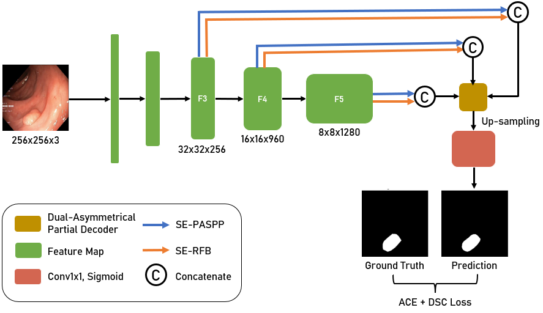
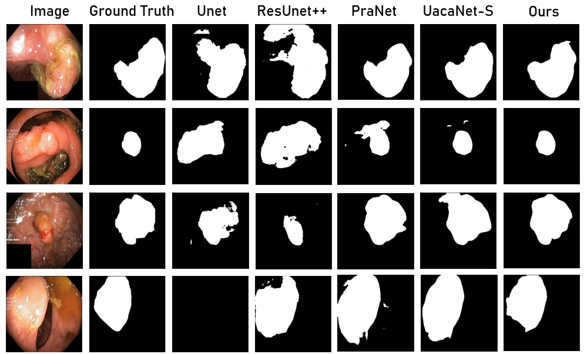

# # Geometrical Constraint-based Advanced Network for Polyp Segmentation (GCA-NET) 

Official Tensorflow implementation of [GCA-Net: Geometrical Constraint-based Advanced Network for Polyp Segmentation](https://proceedings.bmvc2023.org/806/) NICS 2022. 
 <br>
<p>Hanoi University of Sciene and Technology</p>

<b>Author:</b> <b>Quang-Vinh Nguyen, Thi-Thao Tran, Van-Truong Pham</b>

In the 9th NAFOSTED Conference on Information and Computer Science

## Architecture

<p align="center">

</p>

## Qualitative Results

<p align="center">

</p>

## Usage:
### Recommended environment:
```
Python 3.8
Tensorflow 2.12.0
```
Please use ```pip install -r requirements.txt``` to install the dependencies.

### Data preparation:
Download the training and testing datasets [Google Drive](https://drive.google.com/file/d/1pFxb9NbM8mj_rlSawTlcXG1OdVGAbRQC/view?usp=sharing)/[Baidu Drive](https://pan.baidu.com/s/1BTgT27VxvOgKpHrigwm7Bw?) [code:sydz] and move them into 'polyp/' folder.

### Training:
For training, run ```python train.py ```
### Testing:

For Kvasir dataset testing, run ```python test.py --pretrain_path weight.hdf5 --test_name kvasir```

For CVC-Clinic dataset testing, run ```python test.py --pretrain_path weight.hdf5 --test_name clinic```

For CVC-ColonDB dataset testing, run ```python test.py --pretrain_path weight.hdf5 --test_name colon```

For ETIS dataset testing, run ```python test.py --pretrain_path weight.hdf5 --test_name etis```

For CVC-300 dataset testing, run ```python test.py --pretrain_path weight.hdf5 --test_name cvc300```

## :bookmark_tabs: Citation
```
@INPROCEEDINGS{10013367,
  author    = {Nguyen, Quang-Vinh and Tran, Thi-Thao and Pham, Van-Truong},
  booktitle = {2022 9th NAFOSTED Conference on Information and Computer Science (NICS)}, 
  title     = {GCA-Net: Geometrical Constraints-based Advanced Network for Polyp Segmentation}, 
  year      = {2022},
  volume    = {},
  number    = {},
  pages     = {241-246},
  doi       = {10.1109/NICS56915.2022.10013367}}
```

